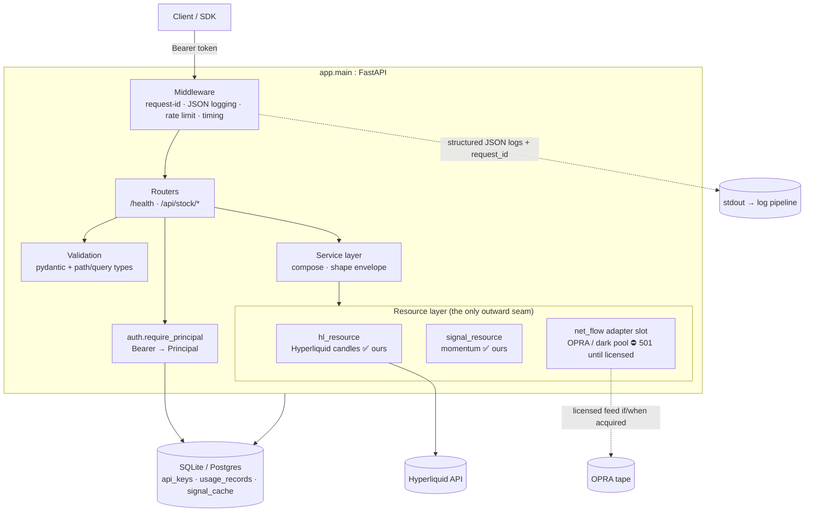

# Pathia Data API

A first-party market-data platform that speaks the **Unusual Whales API
contract** (same request/response shapes) but is backed entirely by **our own
resources**: Hyperliquid crypto candles, xyz tokenized-equity feeds, our
computed signals, and our shadow-ledger track record.

The honest principle, stated once and enforced everywhere below:

> **We clean-room the PLATFORM, not the DATA.**
> Endpoint shapes, auth, pagination, and error semantics are reimplemented from
> the public contract. The numbers behind them come from feeds we actually own
> or license. Anything that needs a licensed feed we don't hold (OPRA options
> tape, dark-pool prints) is a **pluggable adapter slot that returns HTTP 501
> until configured** — we never fabricate data we don't license.

---

## 1. Architecture overview

Layered, single responsibility per layer. Requests flow down; only the
**resource layer** talks to the outside world.



Design rules:

- **One outward seam.** Routers never call Hyperliquid or any upstream directly;
  they call the resource layer. Swapping/adding an upstream is a one-file change.
- **Envelope in, problem out.** Success is `{"data": ...}`; every error is
  RFC7807 `application/problem+json`.
- **Fail honest.** A resource with no configured feed returns `None`; the router
  turns that into `501`, never a guessed number.

---

## 2. Folder structure

```
services/pathia_data_api/
├── app/
│   ├── __init__.py
│   ├── main.py              # create_app(): FastAPI factory, wiring (integration owner)
│   ├── config.py            # Settings (12-factor, env-driven, lru-cached)
│   ├── auth.py              # Bearer → Principal; hashed keys; require_scope
│   ├── db.py                # SQLAlchemy 2.x models + ApiKeyStore + metering
│   ├── logging_setup.py     # JSON formatter + per-request id (ContextVar)
│   └── resources/
│       ├── __init__.py
│       ├── hl_resource.py       # Hyperliquid candles — OUR data
│       └── signal_resource.py   # our_momentum_signal (ours) + net_flow (adapter slot)
├── sdk/
│   ├── pathia_client.py     # typed Python client (httpx)
│   └── README.md            # install + usage + OpenAPI codegen
├── tests/
│   ├── __init__.py
│   ├── conftest.py          # isolated sqlite, seeded key, network-free HL stub
│   └── test_api.py          # health/auth/envelope/501/problem+json/rate-limit
└── README.md                # this file
```

The **service layer** (compose-and-shape logic) lives inside `app/main.py`'s
route handlers today; if it grows, promote it to `app/services/*.py` (see §3).

---

## 3. Internal service layer

The service layer sits between routers and resources. Its job: **compose one or
more resource reads, apply business shaping, and return a plain dict/list** for
the router to wrap in the `{"data": ...}` envelope. It contains no HTTP concerns
and no upstream I/O of its own.

Current services are thin enough to live in the resource modules and the route
handlers:

- **OHLC**: passthrough of `hl_resource.get_ohlc(ticker, interval, limit)`.
- **Momentum**: `signal_resource.our_momentum_signal(coin, lookback)` — reads
  our HL candles and computes `trailing_return = last_close / close_N_ago - 1`.
- **Net-flow**: `signal_resource.net_flow(ticker, date)` — an adapter slot (§4).

When a service needs to fan out (e.g. "flow + momentum + our shadow-ledger
score for one ticker"), add `app/services/<name>.py` that calls multiple
resources and returns the merged dict. Keep it pure and unit-testable: same
inputs → same output, no framework objects in the signature.

---

## 4. Resource layer + the adapter-slot / clean-room principle

The resource layer is the **only** place the app reaches outside itself. Two
kinds of resource live here, and the distinction is the whole product:

**(a) Resources we own.** We connect to the upstream directly and own the math.

- `hl_resource.get_ohlc(coin, interval, limit)` → `list[{t,o,h,l,c,v}]` from
  Hyperliquid. The underlying client is synchronous and is wrapped in
  `asyncio.to_thread(...)` so the event loop never blocks. The seam is *total*:
  it returns `[]` on any failure or empty history and never raises, so callers
  treat "no data" and "upstream hiccup" uniformly.
- `signal_resource.our_momentum_signal(coin, lookback)` → our computed signal,
  built entirely from `hl_resource` candles. We can serve it because we own the
  inputs and the formula.

**(b) Licensed-data adapter slots.** Data we do **not** license, exposed as a
pluggable slot rather than faked.

- `signal_resource.net_flow(ticker, date)` is options net-premium flow, which
  requires the **OPRA options tape** — a licensed feed we don't hold.
  - `settings.options_flow_upstream` **empty** → returns `None` → router answers
    **HTTP 501** "adapter not configured".
  - `settings.options_flow_upstream` **set** → our own licensed feed is wired;
    fetch and normalize. (Until the httpx call is implemented it raises
    `NotImplementedError` on purpose — fail loud, never return fake/empty flow.)

This is the clean-room boundary made concrete: **we reproduce the endpoint
contract; we do not reproduce, proxy, or fabricate a competitor's proprietary
tape.** Adding a licensed feed later is: set the env var, implement the
documented httpx call in the slot, done — no router or SDK change.

---

## 5. Authentication

Bearer token, hashed at rest, resolved to a `Principal` (`app/auth.py`).

- Header: `Authorization: Bearer <token>` (clean-room of the UW scheme).
- Keys live in the DB, never in code. Only the **SHA-256 hex digest** of the
  token is stored (`ApiKey.token_hash`); the raw token is never persisted.
- `require_principal` (a FastAPI dependency) rejects a missing/invalid/inactive
  key with `401` and `WWW-Authenticate: Bearer`.
- `Principal` carries `key_id`, `plan`, `scopes`, `rate_per_min` — consumed by
  rate limiting and by `require_scope("...")` for per-plan endpoint gating
  (`403` when a plan lacks a scope; `*` is a wildcard scope).

Seed a key for local/dev/tests:

```python
from app.db import ApiKeyStore
ApiKeyStore.seed_demo_key("demo-token")            # standard plan, "*" scope
ApiKeyStore.seed_demo_key("slow-key", rate_per_min=1)
```

`seed_demo_key` hashes the raw token exactly the way `auth.hash_token` does, so
lookups line up. It is idempotent.

### Where customer keys come from (2026-09-04)

`seed_demo_key` is for local and test use. **Real keys are minted by a
signed-in wallet**, not seeded here:

```
GET    /auth/keys          list mine
POST   /auth/keys          mint one — the raw token is in this response and nowhere else
DELETE /auth/keys/{key_id} revoke mine
```

That flow lives in `services/auth` (see its README). The table gained one
column, `owner_address`, because without it a key belonged to the deployment
rather than a person and nothing could answer "which keys are mine", "revoke
that one", or "this customer stopped paying".

Two properties worth knowing when reading this service's code:

- **The two services do not import each other.** `services/auth` reaches this
  table in plain SQL. This service is a separate deploy unit with its own
  Dockerfile and requirements, none of which are installed in the trading
  image, so an import would fail at runtime —
  `test_dockerfile_does_not_bundle_pathia_data_api` enforces that. The contract
  is the table, its columns, and `sha256(raw)`, and a test asserts both sides
  still hash alike. If they ever drift, a customer mints a key that opens
  nothing and neither service logs a thing.
- **A customer key never carries `*`.** The demo seed key does; a key inheriting
  it would hold every scope this API ever grows, including ones added years from
  now. Fresh keys get `signals:read`, `candles:read`, `track_record:read`.

`owner_address` is nullable because the demo seed key predates ownership and
belongs to the deployment rather than a person.

---

## 6. Validation

Validation happens at the edge, declaratively, so bad input is a `422` before a
handler runs:

- **Path params** (`ticker`) and **query params** (`interval`, `limit`,
  `lookback`, `date`) are typed on the route signature; FastAPI + pydantic
  coerce and bound-check them (e.g. `limit: int = Query(100, ge=1, le=5000)`).
- **Response models** shape and document the `data` payload in the OpenAPI
  schema, which is what drives the generated SDK (§11).
- Coercion failures surface as `422` with a problem+json body pointing at the
  offending field (§7).

---

## 7. Error handling (RFC7807)

Every error is `application/problem+json` (RFC7807), never a bare string or an
ad-hoc JSON blob. A problem document carries:

```json
{
  "type": "about:blank",
  "title": "Not Implemented",
  "status": 501,
  "detail": "options net-flow adapter not configured (licensed feed required)",
  "instance": "/api/stock/BTC/net-flow"
}
```

Implementation: `app.main` installs exception handlers that map
`HTTPException`, `RequestValidationError`, and uncaught exceptions to a problem
document and set `Content-Type: application/problem+json`. Status→title uses the
standard reason phrase; `detail` is occurrence-specific; `instance` is the
request path. The SDK reads this body back into `PathiaAPIError` (§11).

Canonical statuses: `401` (no/invalid key), `403` (scope/plan), `422`
(validation), `429` (rate limit), `501` (unconfigured adapter slot), `5xx`
(upstream/us).

---

## 8. Rate limiting

**Token bucket, per API key.** Each `Principal` gets a bucket sized/filled from
its `rate_per_min` (with burst capacity from `settings.rate_limit_burst`).
Requests consume a token; an empty bucket returns:

- HTTP `429` with a problem+json body, and
- a **`Retry-After`** header (seconds) so clients back off deterministically.

Config (env, `PATHIA_` prefix):

| Setting | Env | Default | Meaning |
|---|---|---|---|
| `rate_limit_per_min` | `PATHIA_RATE_LIMIT_PER_MIN` | 500 | sustained refill rate |
| `rate_limit_burst` | `PATHIA_RATE_LIMIT_BURST` | 60 | bucket capacity |
| per-key override | `ApiKey.rate_per_min` | 500 | this key's sustained rate |

The in-process bucket is fine for a single replica. For multiple replicas, back
the bucket with Redis (same interface, shared counter) — a resource-layer swap,
not a contract change.

---

## 9. Logging

Structured JSON to stdout, one line per event, with a **per-request id** so a
request is greppable end to end (`app/logging_setup.py`):

```json
{"ts": 1721740000.123, "level": "INFO", "logger": "app.main",
 "msg": "request served", "request_id": "9f2a1c4b7e10",
 "method": "GET", "path": "/api/stock/BTC/ohlc", "status": 200, "latency_ms": 12.4}
```

- `request_id` is a `ContextVar` set by middleware (`new_request_id()`), echoed
  in the `X-Request-Id` response header, and attached to every log line for that
  request.
- `setup_logging(level, as_json)` installs the formatter; `PATHIA_LOG_JSON=false`
  switches to a plain formatter for local readability.
- Extra fields ride on `record.extra_fields`, so metrics (method/path/status/
  latency) land as first-class JSON keys, not string-interpolated into `msg`.

---

## 10. Database models

SQLAlchemy 2.x, typed declarative (`app/db.py`). Runs on **sqlite** out of the
box and is **Postgres-ready** with no code change — every column type used maps
cleanly to both; switch `PATHIA_DATABASE_URL` to a `postgresql://...` DSN.

| Table | Model | Purpose |
|---|---|---|
| `api_keys` | `ApiKey` | tenant credentials: `key_id`, `token_hash` (SHA-256), `plan`, `scopes` (JSON), `rate_per_min`, `active` |
| `usage_records` | `UsageRecord` | one row per served request: `key_id`, `path`, `ts`, `status_code`, `latency_ms` — metering + dashboards |
| `signal_cache` | `SignalCache` | cached upstream read keyed by `(resource, ticker, as_of)` with a JSON `payload` |

Lifecycle: import is side-effect-free apart from building `engine` /
`SessionLocal`; the schema is created only when `init_db()` is called.
`session_scope()` gives a commit/rollback/close transaction; `get_db()` is the
FastAPI request-scoped dependency. `record_usage(...)` runs in its own
transaction so metering can never poison a request's session.

---

## 11. SDK

Two paths, in `sdk/` (see `sdk/README.md`):

1. **Hand-written client** — `sdk/pathia_client.py`. `PathiaDataClient(base_url,
   api_key)` with `health()`, `ohlc()`, `net_flow()`, `momentum()`. Bearer auth,
   unwraps the `data` envelope, raises `PathiaAPIError` (with `title` / `detail`
   / `retry_after`) from the problem+json body on any non-2xx. Small and
   readable; `httpx`-only.
2. **Generated client** — for full coverage, generate from the OpenAPI schema.
   FastAPI serves it at `GET /openapi.json`, and `app.openapi()` returns the
   same dict in-process. Run
   `openapi-python-client generate --url http://127.0.0.1:8000/openapi.json`.

---

## 12. Testing

Two lanes (matches the repo's gate/eval split):

- **Gate tests** — `tests/test_api.py`, deterministic, network-free, fast. They
  assert the *contract*: `/health` 200 (no auth); OHLC `401` without auth and
  `{"data":[...]}` with auth; net-flow `501` (adapter slot unset); an error body
  is `application/problem+json`; a hammered endpoint returns `429` with
  `Retry-After`.
- **Hermeticity** — `tests/conftest.py` points `PATHIA_DATABASE_URL` at a
  throwaway sqlite file **before** importing `app` (so the module-level engine
  binds to it), seeds a demo key, and monkeypatches
  `app.resources.hl_resource.get_ohlc` to a deterministic async stub so no test
  touches the network. If `app.main` isn't wired yet, fixtures `pytest.skip`
  with a clear message rather than erroring collection.

Run:

```bash
cd services/pathia_data_api
python -m pytest tests -v
# from repo root, just this service:
python -m pytest services/pathia_data_api/tests -v
```

---

## 13. Docker

Single-stage slim image; deps first for layer caching. The app is a normal
ASGI app served by uvicorn.

```dockerfile
FROM python:3.11-slim
ENV PYTHONUNBUFFERED=1 PYTHONDONTWRITEBYTECODE=1 PIP_NO_CACHE_DIR=1
WORKDIR /srv
COPY pyproject.toml ./
RUN pip install fastapi "uvicorn[standard]" "httpx>=0.27,<1" \
    "sqlalchemy>=2" "pydantic>=2" "pydantic-settings>=2"
COPY app ./app
EXPOSE 8000
# PATHIA_* env supplies DB URL, rate limits, and (optionally) a licensed feed URL.
CMD ["uvicorn", "app.main:app", "--host", "0.0.0.0", "--port", "8000"]
```

```bash
docker build -t pathia-data-api:local .
docker run --rm -p 8000:8000 \
  -e PATHIA_DATABASE_URL=sqlite:////data/pathia_data.db \
  -e PATHIA_RATE_LIMIT_PER_MIN=500 \
  -v pathia_data:/data \
  pathia-data-api:local
```

For production, point `PATHIA_DATABASE_URL` at Postgres and drop the volume.

---

## 14. Kubernetes

Stateless web tier → a `Deployment` (not a StatefulSet; state lives in Postgres),
fronted by a `Service`, scaled by an `HPA`. Probes hit `/health`.

```yaml
apiVersion: apps/v1
kind: Deployment
metadata: {name: pathia-data-api, namespace: pathia}
spec:
  replicas: 2
  selector: {matchLabels: {app: pathia-data-api}}
  template:
    metadata: {labels: {app: pathia-data-api}}
    spec:
      containers:
        - name: web
          image: pathia-data-api:local
          ports: [{name: http, containerPort: 8000}]
          envFrom:
            - configMapRef: {name: pathia-data-config}   # rate limits, feed URLs
            - secretRef: {name: pathia-data-secrets}      # DATABASE_URL, licensed keys
          readinessProbe: {httpGet: {path: /health, port: http}, initialDelaySeconds: 3}
          livenessProbe:  {httpGet: {path: /health, port: http}, periodSeconds: 10}
          resources:
            requests: {cpu: 100m, memory: 128Mi}
            limits:   {cpu: 500m, memory: 256Mi}
```

Multiple replicas require the shared-Redis rate-limit backend (§8). Licensed-feed
URLs/keys are Secrets, never ConfigMaps.

---

## 15. CI/CD

Mirrors the repo's `.github/workflows/ci.yml`: install with dev extras, run the
offline suite (no network, no real money) on every push/PR.

```yaml
name: pathia-data-api CI
on: [push, pull_request]
jobs:
  test:
    runs-on: ubuntu-latest
    strategy: {matrix: {python-version: ["3.11", "3.12"]}}
    steps:
      - uses: actions/checkout@v4
      - uses: actions/setup-python@v5
        with: {python-version: "${{ matrix.python-version }}", cache: pip}
      - run: pip install fastapi "uvicorn[standard]" "httpx>=0.27,<1" \
               "sqlalchemy>=2" "pydantic>=2" "pydantic-settings>=2" pytest
      - run: python -m pytest services/pathia_data_api/tests -v
  # build+push image and deploy on green main via your registry/cluster of choice.
```

Deploy: build the image on green `main`, push to the registry, `kubectl rollout`
(or Fly). The rollout is gated on the readiness probe (`/health`).

---

## Run locally

```bash
# 1. Install deps
pip install fastapi "uvicorn[standard]" "httpx>=0.27,<1" \
    "sqlalchemy>=2" "pydantic>=2" "pydantic-settings>=2"

# 2. Point at a local sqlite DB and start the server
cd services/pathia_data_api
export PATHIA_DATABASE_URL="sqlite:///./pathia_data.db"
uvicorn app.main:app --reload --port 8000

# 3. Seed a demo key (in another shell)
python -c "from app.db import init_db, ApiKeyStore; init_db(); ApiKeyStore.seed_demo_key('demo-token')"
```

Curl it:

```bash
curl -s localhost:8000/health
# {"status":"ok"}

curl -s -H "Authorization: Bearer demo-token" \
  "localhost:8000/api/stock/BTC/ohlc?interval=1d&limit=5"
# {"data":[{"t":...,"o":...,"h":...,"l":...,"c":...,"v":...}, ...]}

curl -s -H "Authorization: Bearer demo-token" \
  "localhost:8000/api/stock/BTC/momentum?lookback=7"
# {"data":{"coin":"BTC","lookback":7,"trailing_return":0.062}}

# Licensed slot, not configured → honest 501:
curl -s -o /dev/null -w "%{http_code}\n" -H "Authorization: Bearer demo-token" \
  "localhost:8000/api/stock/BTC/net-flow?date=2026-07-23"
# 501
```

Interactive docs: `http://localhost:8000/docs` · schema: `/openapi.json`.

---

## What we serve vs what needs a licensed feed

Honest inventory. No asterisks.

**Live now (backed by our own resources):**

- **OHLC / price** — Hyperliquid candles for crypto, xyz tokenized-equity feeds.
  We connect directly; we own the data.
- **Momentum / computed signals** — derived from our own candles with our own
  formulas.
- **Shadow-ledger track record** — our recorded signal performance (roadmap
  endpoint), which is *ours by construction*.

**Adapter slot — 501 until we license the feed:**

- **Options net-flow / premium** — requires the **OPRA options tape**. Not held.
  Returns `501` until a licensed upstream is configured. We never fabricate it.
- **Dark-pool prints / off-exchange volume** — requires a licensed consolidated
  feed. Same treatment: adapter slot, `501` until wired.
- **Full historical options chains / Greeks** — licensed. Adapter slot.

The dividing line is licensing, not difficulty. If we own the input, we serve
it. If we don't, the endpoint exists and returns `501` — the contract is honest
about the gap rather than filling it with invented numbers.

## Endpoint mapping: UW contract → our implementation

| UW-style endpoint | Our endpoint | Backing | Status |
|---|---|---|---|
| `GET /api/stock/{t}/ohlc` | `GET /api/stock/{t}/ohlc?interval&limit` | Hyperliquid / xyz candles (ours) | ✅ live |
| momentum / trend factor | `GET /api/stock/{t}/momentum?lookback` | computed from our candles | ✅ live |
| `GET /health` | `GET /health` | app liveness | ✅ live |
| `GET /api/stock/{t}/net-prem-flow` | `GET /api/stock/{t}/net-flow?date` | OPRA options tape | ⛔ 501 adapter slot |
| dark-pool prints | `/api/stock/{t}/darkpool` *(planned slot)* | licensed consolidated feed | ⛔ 501 adapter slot |
| options chain / Greeks | `/api/stock/{t}/options` *(planned slot)* | licensed options feed | ⛔ 501 adapter slot |
| our track record | `/api/signal/{name}/record` *(roadmap)* | our shadow ledger (ours) | 🟡 roadmap |

✅ = served from our own resources · ⛔ = adapter slot, returns 501 until a
licensed feed is configured · 🟡 = ours by construction, not yet exposed.
